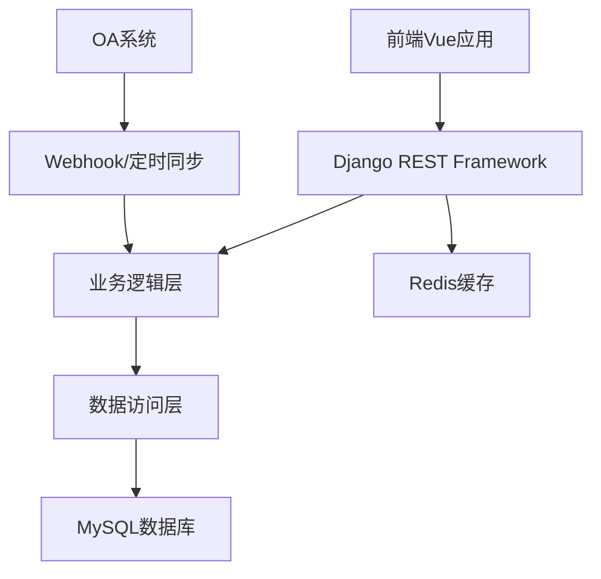
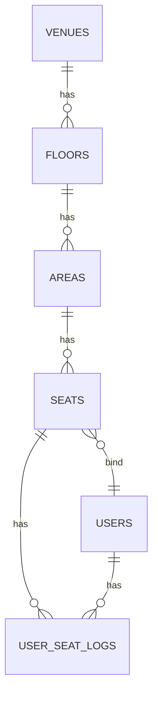

# 工位管理系统后端技术实现文档

## 1. 技术栈选择

| 类别 | 技术 | 版本 | 选型理由 |
| :--- | :--- | :--- | :--- |
| 语言 | Python | 3.9+ | 语法简洁，生态丰富，适合Web开发。 |
| 框架 | Django | 5.0+ | 完整的MVC架构，内置ORM、认证、管理后台等功能，适合快速开发企业级应用。 |
| 数据库 | MySQL | 8.0+ | 稳定可靠，适合存储结构化数据，与Django兼容性好。 |
| 缓存 | Redis | 7.0+ | 用于缓存热点数据和管理Session/Token。 |
| 认证 | JWT | - | 无状态认证，便于水平扩展，适合前后端分离架构。 |
| API风格 | RESTful | - | 标准化的API设计，便于前端调用和维护。 |

## 2. 系统架构设计

### 2.1 架构层次



### 2.2 核心模块划分

| 模块 | 职责 | 文件位置 |
| :--- | :--- | :--- |
| `venues` | 场地管理 | `backend/apps/venues/` |
| `floors` | 楼层管理 | `backend/apps/floors/` |
| `areas` | 区域管理 | `backend/apps/areas/` |
| `seats` | 工位管理 | `backend/apps/seats/` |
| `users` | 人员管理 | `backend/apps/users/` |
| `logs` | 操作日志 | `backend/apps/logs/` |
| `auth` | 认证授权 | `backend/apps/auth/` |
| `oa` | OA系统集成 | `backend/apps/oa/` |
| `utils` | 工具函数 | `backend/utils/` |

## 3. 数据模型设计

### 3.1 模型关系



### 3.2 详细数据模型

#### 3.2.1 场地表 (`venues`)

| 字段名 | 数据类型 | 约束 | 描述 |
| :--- | :--- | :--- | :--- |
| `id` | `BigAutoField` | `primary_key=True` | 场地ID |
| `name` | `CharField` | `max_length=50, unique=True` | 场地名称 |
| `address` | `CharField` | `max_length=200` | 场地地址 |
| `status` | `SmallIntegerField` | `default=1` | 状态(0:停用, 1:启用) |
| `created_at` | `DateTimeField` | `auto_now_add=True` | 创建时间 |
| `updated_at` | `DateTimeField` | `auto_now=True` | 更新时间 |

#### 3.2.2 楼层表 (`floors`)

| 字段名 | 数据类型 | 约束 | 描述 |
| :--- | :--- | :--- | :--- |
| `id` | `BigAutoField` | `primary_key=True` | 楼层ID |
| `venue_id` | `BigIntegerField` | `ForeignKey(Venues)` | 所属场地ID |
| `floor_no` | `CharField` | `max_length=10` | 楼层编号(如"1F") |
| `floor_name` | `CharField` | `max_length=50` | 楼层名称 |
| `image_url` | `CharField` | `max_length=500` | 平面图URL |
| `sort_order` | `IntegerField` | `default=0` | 排序序号 |
| `status` | `SmallIntegerField` | `default=1` | 状态(0:停用, 1:启用) |
| `created_at` | `DateTimeField` | `auto_now_add=True` | 创建时间 |
| `updated_at` | `DateTimeField` | `auto_now=True` | 更新时间 |

#### 3.2.3 区域表 (`areas`)

| 字段名 | 数据类型 | 约束 | 描述 |
| :--- | :--- | :--- | :--- |
| `id` | `BigAutoField` | `primary_key=True` | 区域ID |
| `floor_id` | `BigIntegerField` | `ForeignKey(Floors)` | 所属楼层ID |
| `area_no` | `CharField` | `max_length=20` | 区域编号(如"101") |
| `area_name` | `CharField` | `max_length=50` | 区域名称 |
| `area_type` | `SmallIntegerField` | `default=1` | 区域类型(1:专属区, 2:混合区, 3:会议室, 4:公共区) |
| `allowed_depts` | `TextField` | `default='[]'` | 允许的部门ID列表(JSON格式) |
| `seat_count` | `IntegerField` | `default=0` | 计划工位数 |
| `position_css` | `TextField` | `default='{}'` | 位置样式(JSON格式) |
| `status` | `SmallIntegerField` | `default=1` | 状态(0:停用, 1:启用) |
| `created_at` | `DateTimeField` | `auto_now_add=True` | 创建时间 |
| `updated_at` | `DateTimeField` | `auto_now=True` | 更新时间 |

#### 3.2.4 工位表 (`seats`)

| 字段名 | 数据类型 | 约束 | 描述 |
| :--- | :--- | :--- | :--- |
| `id` | `BigAutoField` | `primary_key=True` | 工位ID |
| `area_id` | `BigIntegerField` | `ForeignKey(Areas)` | 所属区域ID |
| `seat_no` | `CharField` | `max_length=20` | 工位编号(如"101-1") |
| `seat_status` | `SmallIntegerField` | `default=0` | 工位状态(0:闲置, 1:占用, 2:维修中, 3:停用) |
| `grid_row` | `IntegerField` | `default=0` | 网格行号 |
| `grid_col` | `IntegerField` | `default=0` | 网格列号 |
| `position_x` | `FloatField` | `default=0.0` | 相对坐标X(0-1) |
| `position_y` | `FloatField` | `default=0.0` | 相对坐标Y(0-1) |
| `current_user_id` | `CharField` | `max_length=50, null=True` | 当前绑定人员ID(OA工号) |
| `current_user_name` | `CharField` | `max_length=50, null=True` | 人员姓名(冗余) |
| `current_dept_id` | `CharField` | `max_length=50, null=True` | 部门ID(冗余) |
| `bind_type` | `SmallIntegerField` | `default=0` | 绑定类型(0:未绑定, 1:主工位, 2:额外绑定) |
| `created_at` | `DateTimeField` | `auto_now_add=True` | 创建时间 |
| `updated_at` | `DateTimeField` | `auto_now=True` | 更新时间 |

#### 3.2.5 人员表 (`users`)

| 字段名 | 数据类型 | 约束 | 描述 |
| :--- | :--- | :--- | :--- |
| `id` | `CharField` | `max_length=50, primary_key=True` | 人员ID(OA工号) |
| `name` | `CharField` | `max_length=50` | 姓名 |
| `dept_id` | `CharField` | `max_length=50` | 部门ID |
| `dept_name` | `CharField` | `max_length=50` | 部门名称 |
| `position` | `CharField` | `max_length=50` | 职位 |
| `phone` | `CharField` | `max_length=20` | 手机号 |
| `email` | `CharField` | `max_length=100` | 邮箱 |
| `status` | `SmallIntegerField` | `default=1` | 状态(0:离职, 1:在职) |
| `created_at` | `DateTimeField` | `auto_now_add=True` | 创建时间 |
| `updated_at` | `DateTimeField` | `auto_now=True` | 更新时间 |

#### 3.2.6 操作日志表 (`user_seat_logs`)

| 字段名 | 数据类型 | 约束 | 描述 |
| :--- | :--- | :--- | :--- |
| `id` | `BigAutoField` | `primary_key=True` | 日志ID |
| `user_id` | `CharField` | `max_length=50` | 人员ID |
| `user_name` | `CharField` | `max_length=50` | 人员姓名 |
| `seat_id` | `BigIntegerField` | `ForeignKey(Seats)` | 工位ID |
| `operation` | `SmallIntegerField` | - | 操作类型(1:绑定, 2:解绑, 3:更换, 4:额外绑定) |
| `old_seat_id` | `BigIntegerField` | `null=True` | 更换时的原工位ID |
| `operator_id` | `CharField` | `max_length=50` | 操作人ID |
| `operator_name` | `CharField` | `max_length=50` | 操作人姓名 |
| `created_at` | `DateTimeField` | `auto_now_add=True` | 操作时间 |

## 4. API接口设计

### 4.1 认证接口

| API路径 | 方法 | 模块/文件 | 类型 | 功能描述 | 请求体 (JSON) | 成功响应 (200 OK) |
| :--- | :--- | :--- | :--- | :--- | :--- | :--- |
| `/api/auth/login` | `POST` | `auth/views.py` | `Router` | 用户登录 | `{"username": "admin", "password": "123456"}` | `{"access": "jwt_token", "refresh": "refresh_token"}` |
| `/api/auth/refresh` | `POST` | `auth/views.py` | `Router` | 刷新Token | `{"refresh": "refresh_token"}` | `{"access": "new_jwt_token"}` |
| `/api/auth/logout` | `POST` | `auth/views.py` | `Router` | 用户登出 | N/A | `{"detail": "Successfully logged out."}` |

### 4.2 管理端接口

#### 4.2.1 场地管理

| API路径 | 方法 | 模块/文件 | 类型 | 功能描述 | 请求体 (JSON) | 成功响应 (200 OK) |
| :--- | :--- | :--- | :--- | :--- | :--- | :--- |
| `/api/admin/venues` | `GET` | `venues/views.py` | `Router` | 获取场地列表 | N/A | `[{"id": 1, "name": "总部大楼", "address": "北京市朝阳区...", "status": 1}]` |
| `/api/admin/venues` | `POST` | `venues/views.py` | `Router` | 创建场地 | `{"name": "总部大楼", "address": "北京市朝阳区...", "status": 1}` | `{"id": 1, "name": "总部大楼", "address": "北京市朝阳区...", "status": 1}` |
| `/api/admin/venues/{id}` | `GET` | `venues/views.py` | `Router` | 获取场地详情 | N/A | `{"id": 1, "name": "总部大楼", "address": "北京市朝阳区...", "status": 1}` |
| `/api/admin/venues/{id}` | `PUT` | `venues/views.py` | `Router` | 更新场地 | `{"name": "总部大楼", "address": "北京市朝阳区...", "status": 1}` | `{"id": 1, "name": "总部大楼", "address": "北京市朝阳区...", "status": 1}` |
| `/api/admin/venues/{id}` | `DELETE` | `venues/views.py` | `Router` | 删除场地 | N/A | `{"detail": "Venue deleted successfully."}` |

#### 4.2.2 楼层管理

| API路径 | 方法 | 模块/文件 | 类型 | 功能描述 | 请求体 (JSON) | 成功响应 (200 OK) |
| :--- | :--- | :--- | :--- | :--- | :--- | :--- |
| `/api/admin/floors` | `GET` | `floors/views.py` | `Router` | 获取楼层列表 | N/A | `[{"id": 1, "venue_id": 1, "floor_no": "1F", "floor_name": "一层", "image_url": "...", "sort_order": 1, "status": 1}]` |
| `/api/admin/floors` | `POST` | `floors/views.py` | `Router` | 创建楼层 | `{"venue_id": 1, "floor_no": "1F", "floor_name": "一层", "image_url": "...", "sort_order": 1, "status": 1}` | `{"id": 1, "venue_id": 1, "floor_no": "1F", "floor_name": "一层", "image_url": "...", "sort_order": 1, "status": 1}` |
| `/api/admin/floors/{id}` | `GET` | `floors/views.py` | `Router` | 获取楼层详情 | N/A | `{"id": 1, "venue_id": 1, "floor_no": "1F", "floor_name": "一层", "image_url": "...", "sort_order": 1, "status": 1}` |
| `/api/admin/floors/{id}` | `PUT` | `floors/views.py` | `Router` | 更新楼层 | `{"venue_id": 1, "floor_no": "1F", "floor_name": "一层", "image_url": "...", "sort_order": 1, "status": 1}` | `{"id": 1, "venue_id": 1, "floor_no": "1F", "floor_name": "一层", "image_url": "...", "sort_order": 1, "status": 1}` |
| `/api/admin/floors/{id}` | `DELETE` | `floors/views.py` | `Router` | 删除楼层 | N/A | `{"detail": "Floor deleted successfully."}` |

#### 4.2.3 区域管理

| API路径 | 方法 | 模块/文件 | 类型 | 功能描述 | 请求体 (JSON) | 成功响应 (200 OK) |
| :--- | :--- | :--- | :--- | :--- | :--- | :--- |
| `/api/admin/areas` | `GET` | `areas/views.py` | `Router` | 获取区域列表 | N/A | `[{"id": 1, "floor_id": 1, "area_no": "101", "area_name": "大数据部", "area_type": 1, "allowed_depts": "[\"D01\"]", "seat_count": 20, "position_css": "{...}", "status": 1}]` |
| `/api/admin/areas` | `POST` | `areas/views.py` | `Router` | 创建区域 | `{"floor_id": 1, "area_no": "101", "area_name": "大数据部", "area_type": 1, "allowed_depts": "[\"D01\"]", "seat_count": 20, "position_css": "{...}", "status": 1}` | `{"id": 1, "floor_id": 1, "area_no": "101", "area_name": "大数据部", "area_type": 1, "allowed_depts": "[\"D01\"]", "seat_count": 20, "position_css": "{...}", "status": 1}` |
| `/api/admin/areas/{id}` | `GET` | `areas/views.py` | `Router` | 获取区域详情 | N/A | `{"id": 1, "floor_id": 1, "area_no": "101", "area_name": "大数据部", "area_type": 1, "allowed_depts": "[\"D01\"]", "seat_count": 20, "position_css": "{...}", "status": 1}` |
| `/api/admin/areas/{id}` | `PUT` | `areas/views.py` | `Router` | 更新区域 | `{"floor_id": 1, "area_no": "101", "area_name": "大数据部", "area_type": 1, "allowed_depts": "[\"D01\"]", "seat_count": 20, "position_css": "{...}", "status": 1}` | `{"id": 1, "floor_id": 1, "area_no": "101", "area_name": "大数据部", "area_type": 1, "allowed_depts": "[\"D01\"]", "seat_count": 20, "position_css": "{...}", "status": 1}` |
| `/api/admin/areas/{id}` | `DELETE` | `areas/views.py` | `Router` | 删除区域 | N/A | `{"detail": "Area deleted successfully."}` |

#### 4.2.4 工位管理

| API路径 | 方法 | 模块/文件 | 类型 | 功能描述 | 请求体 (JSON) | 成功响应 (200 OK) |
| :--- | :--- | :--- | :--- | :--- | :--- | :--- |
| `/api/admin/seats/generate` | `POST` | `seats/views.py` | `Router` | 批量生成工位 | `{"area_id": 1, "count": 20}` | `{"detail": "20 seats generated successfully."}` |
| `/api/admin/seats` | `GET` | `seats/views.py` | `Router` | 获取工位列表 | N/A | `[{"id": 1, "area_id": 1, "seat_no": "101-1", "seat_status": 0, "grid_row": 1, "grid_col": 1, "position_x": 0.1, "position_y": 0.1, "current_user_id": null, "current_user_name": null, "current_dept_id": null, "bind_type": 0}]` |
| `/api/admin/seats/{id}` | `GET` | `seats/views.py` | `Router` | 获取工位详情 | N/A | `{"id": 1, "area_id": 1, "seat_no": "101-1", "seat_status": 0, "grid_row": 1, "grid_col": 1, "position_x": 0.1, "position_y": 0.1, "current_user_id": null, "current_user_name": null, "current_dept_id": null, "bind_type": 0}` |
| `/api/admin/seats/{id}` | `PUT` | `seats/views.py` | `Router` | 更新工位 | `{"seat_status": 2}` | `{"id": 1, "area_id": 1, "seat_no": "101-1", "seat_status": 2, "grid_row": 1, "grid_col": 1, "position_x": 0.1, "position_y": 0.1, "current_user_id": null, "current_user_name": null, "current_dept_id": null, "bind_type": 0}` |
| `/api/admin/seats/{id}` | `DELETE` | `seats/views.py` | `Router` | 删除工位 | N/A | `{"detail": "Seat deleted successfully."}` |

#### 4.2.5 人员绑定

| API路径 | 方法 | 模块/文件 | 类型 | 功能描述 | 请求体 (JSON) | 成功响应 (200 OK) |
| :--- | :--- | :--- | :--- | :--- | :--- | :--- |
| `/api/admin/seat/bind` | `POST` | `seats/views.py` | `Router` | 绑定人员 | `{"seat_id": 1, "user_id": "1001", "bind_type": 1}` | `{"detail": "User bound to seat successfully."}` |
| `/api/admin/seat/unbind` | `POST` | `seats/views.py` | `Router` | 解绑人员 | `{"seat_id": 1}` | `{"detail": "User unbound from seat successfully."}` |
| `/api/admin/seat/transfer` | `POST` | `seats/views.py` | `Router` | 更换工位 | `{"old_seat_id": 1, "new_seat_id": 2, "user_id": "1001"}` | `{"detail": "User transferred to new seat successfully."}` |
| `/api/admin/seat/extra-bind` | `POST` | `seats/views.py` | `Router` | 额外绑定 | `{"seat_id": 2, "user_id": "1001"}` | `{"detail": "User extra bound to seat successfully."}` |

#### 4.2.6 操作日志

| API路径 | 方法 | 模块/文件 | 类型 | 功能描述 | 请求体 (JSON) | 成功响应 (200 OK) |
| :--- | :--- | :--- | :--- | :--- | :--- | :--- |
| `/api/admin/logs` | `GET` | `logs/views.py` | `Router` | 获取操作日志 | N/A | `[{"id": 1, "user_id": "1001", "user_name": "张三", "seat_id": 1, "operation": 1, "old_seat_id": null, "operator_id": "admin", "operator_name": "管理员", "created_at": "2026-01-26T10:00:00Z"}]` |
| `/api/admin/logs/{id}` | `GET` | `logs/views.py` | `Router` | 获取日志详情 | N/A | `{"id": 1, "user_id": "1001", "user_name": "张三", "seat_id": 1, "operation": 1, "old_seat_id": null, "operator_id": "admin", "operator_name": "管理员", "created_at": "2026-01-26T10:00:00Z"}` |

### 4.3 员工端接口

| API路径 | 方法 | 模块/文件 | 类型 | 功能描述 | 请求体 (JSON) | 成功响应 (200 OK) |
| :--- | :--- | :--- | :--- | :--- | :--- | :--- |
| `/api/user/floors` | `GET` | `users/views.py` | `Router` | 获取楼层列表 | N/A | `[{"id": 1, "venue_id": 1, "floor_no": "1F", "floor_name": "一层", "image_url": "...", "sort_order": 1, "status": 1}]` |
| `/api/user/floor/{id}` | `GET` | `users/views.py` | `Router` | 获取楼层详情(含区域、工位) | N/A | `{"id": 1, "venue_id": 1, "floor_no": "1F", "floor_name": "一层", "image_url": "...", "areas": [{"id": 1, "area_no": "101", "area_name": "大数据部", "seats": [{"id": 1, "seat_no": "101-1", "seat_status": 0, "current_user_id": null, "current_user_name": null}]}]}` |
| `/api/user/search` | `GET` | `users/views.py` | `Router` | 全局搜索 | N/A (Query参数: `q=张三`) | `{"users": [{"id": "1001", "name": "张三", "dept_name": "技术部", "position": "高级工程师"}], "seats": [{"id": 1, "seat_no": "101-1", "seat_status": 1, "current_user_name": "张三"}]}` |
| `/api/user/seat/{id}` | `GET` | `users/views.py` | `Router` | 获取工位详情 | N/A | `{"id": 1, "area_id": 1, "seat_no": "101-1", "seat_status": 1, "current_user_id": "1001", "current_user_name": "张三", "current_dept_id": "D01", "current_dept_name": "技术部", "position": "高级工程师", "phone": "13800138000", "email": "zhangsan@company.com"}` |
| `/api/user/my-seat` | `GET` | `users/views.py` | `Router` | 获取我的工位信息 | N/A | `{"seats": [{"id": 1, "seat_no": "101-1", "area_name": "大数据部", "floor_name": "一层", "venue_name": "总部大楼", "bind_type": 1}, {"id": 2, "seat_no": "102-1", "area_name": "研发部", "floor_name": "一层", "venue_name": "总部大楼", "bind_type": 2}]}` |

### 4.4 OA集成接口

| API路径 | 方法 | 模块/文件 | 类型 | 功能描述 | 请求体 (JSON) | 成功响应 (200 OK) |
| :--- | :--- | :--- | :--- | :--- | :--- | :--- |
| `/api/oa/users/sync` | `POST` | `oa/views.py` | `Router` | 全量同步人员信息 | `{"users": [{"user_id": "1001", "name": "张三", "dept_id": "D01", "dept_name": "技术部", "position": "高级工程师", "phone": "13800138000", "email": "zhangsan@company.com", "status": "在职"}]}` | `{"detail": "Users synced successfully."}` |
| `/api/oa/user/query` | `GET` | `oa/views.py` | `Router` | 实时查询人员详情 | N/A (Query参数: `user_id=1001`) | `{"user_id": "1001", "name": "张三", "dept_id": "D01", "dept_name": "技术部", "position": "高级工程师", "phone": "13800138000", "email": "zhangsan@company.com", "status": "在职"}` |
| `/api/oa/departments` | `GET` | `oa/views.py` | `Router` | 获取部门组织架构 | N/A | `[{"dept_id": "D01", "dept_name": "技术部", "children": [{"dept_id": "D01-01", "dept_name": "前端组"}, {"dept_id": "D01-02", "dept_name": "后端组"}]}]` |
| `/api/oa/user/change` | `POST` | `oa/views.py` | `Router` | 人员变更通知(Webhook) | `{"user_id": "1001", "name": "张三", "dept_id": "D02", "dept_name": "产品部", "position": "产品经理", "phone": "13800138000", "email": "zhangsan@company.com", "status": "在职", "change_type": "transfer"}` | `{"detail": "User change processed successfully."}` |

## 5. 核心业务逻辑实现

### 5.1 工位生成逻辑

```python
# seats/services.py
def generate_seats(area_id, count):
    """
    在指定区域内生成工位网格
    """
    area = Area.objects.get(id=area_id)
    
    # 计算最优行列布局
    import math
    width_ratio = 1.5  # 假设工位宽高比为1.5:1
    cols = math.ceil(math.sqrt(count * width_ratio))
    rows = math.ceil(count / cols)
    
    # 生成工位
    seats = []
    for i in range(count):
        row = i // cols + 1
        col = i % cols + 1
        
        # 计算工位坐标
        position_x = (col - 0.5) / cols
        position_y = (row - 0.5) / rows
        
        # 生成工位编号
        seat_no = f"{area.area_no}-{i+1}"
        
        seat = Seat(
            area_id=area_id,
            seat_no=seat_no,
            seat_status=0,  # 初始状态为闲置
            grid_row=row,
            grid_col=col,
            position_x=position_x,
            position_y=position_y,
            bind_type=0  # 初始未绑定
        )
        seats.append(seat)
    
    # 批量创建工位
    Seat.objects.bulk_create(seats)
    
    # 更新区域工位数
    area.seat_count = count
    area.save()
    
    return count
```

### 5.2 人员绑定逻辑

```python
# seats/services.py
def bind_user_to_seat(seat_id, user_id, bind_type=1, operator_id="system", operator_name="系统"):
    """
    绑定人员到工位
    """
    seat = Seat.objects.get(id=seat_id)
    user = User.objects.get(id=user_id)
    
    # 检查工位状态
    if seat.seat_status != 0:
        raise ValueError("Seat is not available.")
    
    # 检查人员状态
    if user.status != 1:
        raise ValueError("User is not active.")
    
    # 记录操作前状态
    old_user_id = seat.current_user_id
    old_user_name = seat.current_user_name
    
    # 更新工位信息
    seat.current_user_id = user_id
    seat.current_user_name = user.name
    seat.current_dept_id = user.dept_id
    seat.seat_status = 1  # 状态改为占用
    seat.bind_type = bind_type
    seat.save()
    
    # 记录操作日志
    UserSeatLog.objects.create(
        user_id=user_id,
        user_name=user.name,
        seat_id=seat_id,
        operation=1 if bind_type == 1 else 4,  # 1:绑定, 4:额外绑定
        old_seat_id=None,
        operator_id=operator_id,
        operator_name=operator_name
    )
    
    return seat
```

### 5.3 工位更换逻辑

```python
# seats/services.py
def transfer_user_seat(old_seat_id, new_seat_id, user_id, operator_id="system", operator_name="系统"):
    """
    更换人员工位
    """
    old_seat = Seat.objects.get(id=old_seat_id)
    new_seat = Seat.objects.get(id=new_seat_id)
    user = User.objects.get(id=user_id)
    
    # 检查原工位是否属于该用户
    if old_seat.current_user_id != user_id:
        raise ValueError("Old seat does not belong to the user.")
    
    # 检查新工位状态
    if new_seat.seat_status != 0:
        raise ValueError("New seat is not available.")
    
    # 解绑原工位
    old_seat.current_user_id = None
    old_seat.current_user_name = None
    old_seat.current_dept_id = None
    old_seat.seat_status = 0  # 状态改为闲置
    old_seat.bind_type = 0  # 改为未绑定
    old_seat.save()
    
    # 绑定新工位
    new_seat.current_user_id = user_id
    new_seat.current_user_name = user.name
    new_seat.current_dept_id = user.dept_id
    new_seat.seat_status = 1  # 状态改为占用
    new_seat.bind_type = 1  # 主工位
    new_seat.save()
    
    # 记录操作日志
    UserSeatLog.objects.create(
        user_id=user_id,
        user_name=user.name,
        seat_id=new_seat_id,
        operation=3,  # 3:更换
        old_seat_id=old_seat_id,
        operator_id=operator_id,
        operator_name=operator_name
    )
    
    return new_seat
```

### 5.4 搜索逻辑

```python
# users/services.py
def search(query):
    """
    全局搜索人员和工位
    """
    # 搜索人员
    users = User.objects.filter(
        Q(name__icontains=query) | Q(id__icontains=query) | Q(dept_name__icontains=query)
    ).filter(status=1)[:10]
    
    # 搜索工位
    seats = Seat.objects.filter(
        Q(seat_no__icontains=query)
    )[:10]
    
    # 格式化结果
    user_results = []
    for user in users:
        user_results.append({
            "id": user.id,
            "name": user.name,
            "dept_name": user.dept_name,
            "position": user.position
        })
    
    seat_results = []
    for seat in seats:
        seat_results.append({
            "id": seat.id,
            "seat_no": seat.seat_no,
            "seat_status": seat.seat_status,
            "current_user_name": seat.current_user_name
        })
    
    return {
        "users": user_results,
        "seats": seat_results
    }
```

## 6. 项目结构

```
seat-management-backend/
├── backend/
│   ├── apps/
│   │   ├── auth/
│   │   │   ├── __init__.py
│   │   │   ├── models.py
│   │   │   ├── views.py
│   │   │   ├── serializers.py
│   │   │   └── urls.py
│   │   ├── venues/
│   │   │   ├── __init__.py
│   │   │   ├── models.py
│   │   │   ├── views.py
│   │   │   ├── serializers.py
│   │   │   └── urls.py
│   │   ├── floors/
│   │   │   ├── __init__.py
│   │   │   ├── models.py
│   │   │   ├── views.py
│   │   │   ├── serializers.py
│   │   │   └── urls.py
│   │   ├── areas/
│   │   │   ├── __init__.py
│   │   │   ├── models.py
│   │   │   ├── views.py
│   │   │   ├── serializers.py
│   │   │   └── urls.py
│   │   ├── seats/
│   │   │   ├── __init__.py
│   │   │   ├── models.py
│   │   │   ├── views.py
│   │   │   ├── serializers.py
│   │   │   ├── services.py
│   │   │   └── urls.py
│   │   ├── users/
│   │   │   ├── __init__.py
│   │   │   ├── models.py
│   │   │   ├── views.py
│   │   │   ├── serializers.py
│   │   │   ├── services.py
│   │   │   └── urls.py
│   │   ├── logs/
│   │   │   ├── __init__.py
│   │   │   ├── models.py
│   │   │   ├── views.py
│   │   │   ├── serializers.py
│   │   │   └── urls.py
│   │   └── oa/
│   │       ├── __init__.py
│   │       ├── models.py
│   │       ├── views.py
│   │       ├── serializers.py
│   │       ├── services.py
│   │       └── urls.py
│   ├── utils/
│   │   ├── __init__.py
│   │   ├── jwt.py
│   │   ├── pagination.py
│   │   └── validators.py
│   ├── settings/
│   │   ├── __init__.py
│   │   ├── base.py
│   │   ├── development.py
│   │   └── production.py
│   ├── urls.py
│   ├── wsgi.py
│   └── asgi.py
├── manage.py
├── requirements.txt
├── README.md
└── .env.example
```

## 7. 部署方案

### 7.1 环境要求

| 依赖 | 版本/范围 | 安装命令 |
| :--- | :--- | :--- |
| Python | 3.9+ | `apt install python3.9` (Ubuntu) |
| MySQL | 8.0+ | `apt install mysql-server-8.0` (Ubuntu) |
| Redis | 7.0+ | `apt install redis-server` (Ubuntu) |
| Django | 5.0+ | `pip install Django==5.0` |
| djangorestframework | 3.15+ | `pip install djangorestframework` |
| djangorestframework-simplejwt | 5.0+ | `pip install djangorestframework-simplejwt` |
| mysqlclient | 2.2+ | `pip install mysqlclient` |
| redis | 4.0+ | `pip install redis` |
| python-dotenv | 1.0+ | `pip install python-dotenv` |
| gunicorn | 21.0+ | `pip install gunicorn` |
| nginx | 1.20+ | `apt install nginx` (Ubuntu) |

### 7.2 部署步骤

1. **准备环境**
   - 安装Python 3.9+、MySQL 8.0+、Redis 7.0+、Nginx
   - 创建虚拟环境：`python3 -m venv venv`
   - 激活虚拟环境：`source venv/bin/activate` (Linux) 或 `venv\Scripts\activate` (Windows)

2. **安装依赖**
   - 复制 `requirements.txt` 到服务器
   - 安装依赖：`pip install -r requirements.txt`

3. **配置数据库**
   - 创建数据库：`CREATE DATABASE seat_management CHARACTER SET utf8mb4 COLLATE utf8mb4_unicode_ci;`
   - 创建数据库用户：`CREATE USER 'seat_management'@'localhost' IDENTIFIED BY 'password';`
   - 授权：`GRANT ALL PRIVILEGES ON seat_management.* TO 'seat_management'@'localhost';`
   - 刷新权限：`FLUSH PRIVILEGES;`

4. **配置项目**
   - 复制项目代码到服务器
   - 复制 `.env.example` 为 `.env` 并配置相关参数
   - 运行数据库迁移：`python manage.py migrate`
   - 创建超级用户：`python manage.py createsuperuser`

5. **配置Gunicorn**
   - 创建Gunicorn配置文件：`gunicorn.conf.py`
   - 启动Gunicorn：`gunicorn backend.wsgi:application --config gunicorn.conf.py`

6. **配置Nginx**
   - 创建Nginx配置文件：`/etc/nginx/sites-available/seat-management`
   - 启用配置：`ln -s /etc/nginx/sites-available/seat-management /etc/nginx/sites-enabled/`
   - 重启Nginx：`systemctl restart nginx`

7. **配置Supervisor**
   - 安装Supervisor：`apt install supervisor`
   - 创建Supervisor配置文件：`/etc/supervisor/conf.d/seat-management.conf`
   - 启动Supervisor：`systemctl start supervisor`
   - 加载配置：`supervisorctl reload`

## 8. 监控与维护

### 8.1 日志管理

- **应用日志**：配置在 `settings.py` 中，默认存储在 `logs/` 目录
- **Nginx日志**：默认存储在 `/var/log/nginx/` 目录
- **Gunicorn日志**：配置在 `gunicorn.conf.py` 中

### 8.2 性能监控

- **使用Prometheus + Grafana** 监控系统性能
- **关键指标**：
  - API响应时间
  - 数据库查询时间
  - 系统CPU、内存使用率
  - 并发连接数

### 8.3 数据库维护

- **定期备份**：使用 `mysqldump` 定期备份数据库
- **索引优化**：根据查询模式优化数据库索引
- **慢查询分析**：开启慢查询日志，分析并优化慢查询

### 8.4 常见问题排查

| 问题 | 可能原因 | 解决方案 |
| :--- | :--- | :--- |
| API响应缓慢 | 数据库查询未优化 | 检查并优化SQL查询，添加合适的索引 |
| 数据库连接失败 | 数据库服务未运行或连接参数错误 | 检查数据库服务状态和连接参数 |
| Token验证失败 | Token过期或无效 | 重新登录获取新Token，检查Token配置 |
| 工位绑定失败 | 工位状态错误或人员状态错误 | 检查工位和人员状态，确保工位闲置且人员在职 |

## 9. 总结

本技术实现文档详细说明了工位管理系统后端的设计方案，包括技术选型、架构设计、数据模型、API设计和核心业务逻辑。通过使用Django框架和RESTful API设计，实现了一个功能完整、性能可靠的后端系统，能够满足前端Vue应用的所有数据需求。

系统设计考虑了可扩展性、安全性和可维护性，采用了模块化的架构设计和标准化的API接口，便于后续的功能扩展和系统维护。同时，通过与OA系统的集成，实现了人员信息的自动同步，提高了系统的自动化水平和数据准确性。

本方案已经考虑了PRD文档中的所有功能需求，包括场地管理、楼层管理、区域管理、工位管理、人员绑定、操作日志等核心功能，并提供了详细的API接口设计和业务逻辑实现。